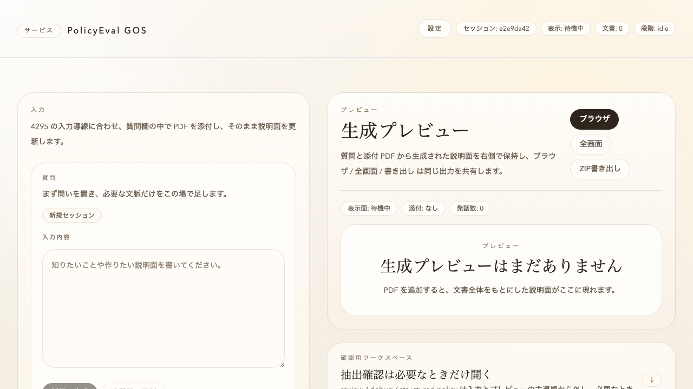

# PolicyGOS

PolicyGOS は、行政・政策関連 PDF をもとに、住民向けや議員向けの briefing を生成するためのローカル実行型 OSS です。

このリポジトリは、試作コードの置き場ではなく、実際に clone して動かせる公開用リポジトリとして整備しています。



## 1. 何ができるか

- prompt-first の composer から briefing を起動する
- PDF を composer に添付して、質問と一緒に扱う
- OCR / repair / source discovery を使って PDF を処理する
- browser / fullscreen / ZIP export の各出力を扱う
- 実 PDF を使った E2E で主要フローを確認する

## 2. 想定する利用者

- 行政資料を住民向けに説明したい人
- 政策 PDF の論点や評価指標を briefing として整理したい人
- PDF を添付して質問起点の説明ページを作りたい人

## 3. リポジトリ構成

- `policyevaluationGOS/`
  - React + Vite + Electron ベースの frontend
  - prompt-first の composer UI
  - PDF 添付、preview、export、E2E テスト
- `document_ocr_api/`
  - FastAPI ベースの backend
  - PDF 読み込み、OCR fallback、repair、source discovery
- `docs-open/`
  - 公開向けドキュメント

## 4. クイックスタート

### 4.1 frontend 依存関係

```bash
cd policyevaluationGOS
npm install
```

### 4.2 backend 依存関係

```bash
cd document_ocr_api
/opt/homebrew/bin/python3.12 -m venv venv312
source venv312/bin/activate
pip install --upgrade pip
pip install -r requirements.txt
pip install paddlepaddle paddleocr 'paddlex[ocr]'
```

Windows では `py -3.12 -m venv venv312` を使ってください。

### 4.3 推奨起動

```bash
cd policyevaluationGOS
npm run debug:full
```

この起動フローでは backend identity を検証し、ローカル backend は空いている 5 桁 port に自動で立ち上がります。

## 5. よく使うコマンド

```bash
cd policyevaluationGOS
npm run type-check
npm test
npm run build
npx playwright test tests/e2e/workspace-real-pdf.spec.ts
```

## 6. ドキュメント

公開向け文書は `docs-open/` を参照してください。

- `docs-open/overview-ja.md`
- `docs-open/development-ja.md`
- `docs-open/publication-notes-ja.md`

コミュニティ向けファイル:

- `CONTRIBUTING.md`
- `SECURITY.md`

## 7. 注意事項

- 本 OSS はローカル実行を前提としています
- OCR 精度や表構造抽出精度は PDF 品質に依存します
- 一部の flow では Gemini API key など外部 LLM の設定が必要です
- backend の identity を検証しない古い起動方法では、誤った local service に接続する可能性があります

## 8. ライセンス

MIT
